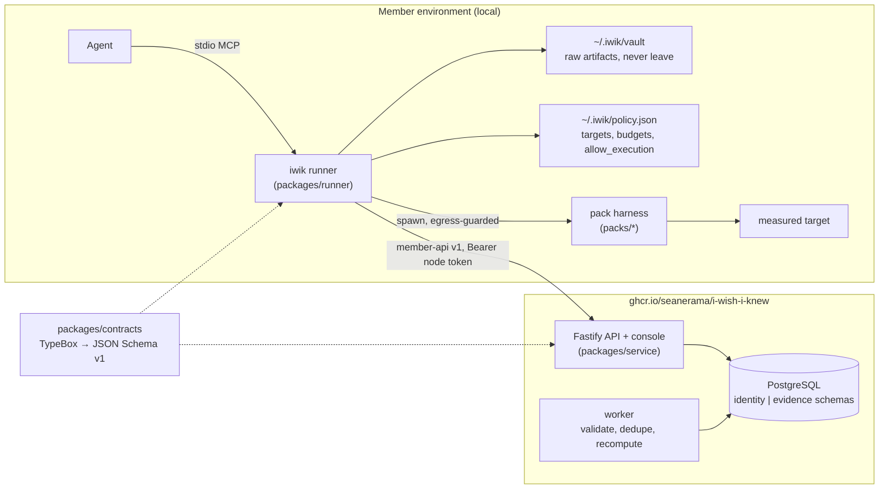

# I Wish I Knew — architecture overview

Design record for the pilot. Product intent lives in
[`../i-wish-i-knew-architect-brief.md`](../i-wish-i-knew-architect-brief.md);
decisions live in [`adr/`](adr/); frozen interfaces live in
[`../contracts/`](../contracts/). This page is the map.

## Shape

One repository, one deployable image, one installable CLI (ADR-0001).

## Modules inside the service

| Module | Responsibility | Brief section |
|---|---|---|
| `identity` | organizations, nodes, token issue/revoke, scopes | R12, ADR-0006 |
| `registry` | accepted `ProtocolVersion`s loaded from `packs/` at build, lifecycle states | §4 |
| `intake` | schema validation, secret rescan, preview binding, idempotent insert, signature check, dedupe of repeated uploads | R4, R5, §7 |
| `evidence` | encrypted feature rows, relationships, revisions, withdrawal | R8, R9, ADR-0002 |
| `matching` | hard compatibility then soft ranking | ADR-0003 |
| `aggregate` | versioned calculations, cohort thresholds, suppression, receipts | R6, R7 |
| `challenge` | challenges, outcomes, prediction ledger | R9, R10 |
| `console` | server-rendered member and operator pages | §4 |
| `jobs` | durable job table, idempotent workers | §8 |

These are directories under `packages/service/src/`. They split into services
only on demonstrated need.

## Trust boundary for the pilot (ADR-0002)

Central sanitized store with per-organization envelope encryption. **Operators
are inside the trust boundary during the pilot** and the product says so.
Operator exclusion is a gate before the first real-member release.

## Phase map from the brief to Verity stages

| Brief phase | Stages (owned by `/verity:plan`) |
|---|---|
| 1 Contracts and trust model | this design + Stage 0 walking skeleton |
| 2 Local investigation | runner plan/run/preview against the fixture server; local report with an empty commons; `SKILL.md` |
| 3 Protected cooperative | identity + enrollment console, intake hardening, encryption, dedupe, withdrawal, receipts |
| 4 Evidence-backed answers | matching, aggregation, suppression, challenge/outcome ledger |
| 5 Pilot validation | second-domain fixture, replication, decision-quality evaluation, operator-exclusion gate ADR |

The eight minimum demonstrations in brief §9 become acceptance tests that the
Planner attaches to the stages above.

## Deferred on purpose

Custom agent framework, protocol marketplace, public leaderboard, new
cryptography, hosted MCP endpoint, real-time causal engine, a Python stats
worker, and the `helper-bot` drop-in feature (ADR-0001 consequences).
