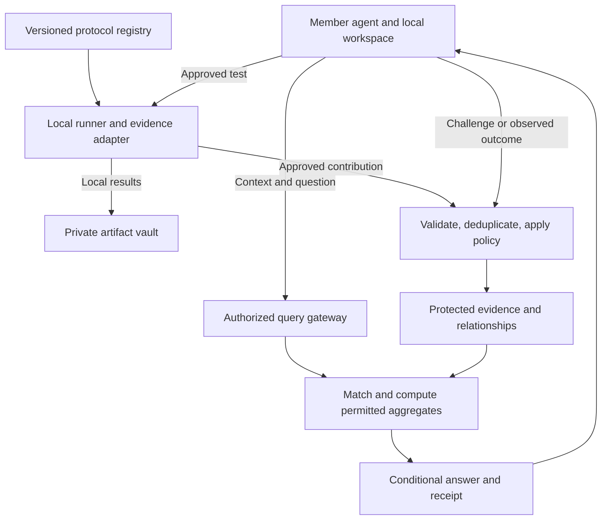

# I Wish I Knew

## Platform vision and architecture handoff

**Audience:** Lead software architect and subsequent implementation agents  
**Status:** Proposed design brief; implementation has not been established by this document  
**Date:** September 5, 2026  
**Decision authority:** The lead architect reviews the proposals and makes the final architecture, technology, and delivery decisions.

This brief consolidates the generic concept briefing and the confidential evidence-cloud direction. It stands alone; earlier illustrations and conversations are not prerequisites. “NetClaw Evidence Cloud” was a network-focused exploration. The product described here is broader, with NetClaw as one possible integration.

**Read this as three layers:** product intent to preserve, functional requirements to turn into acceptance criteria, and implementation suggestions to evaluate. Proposed tools, thresholds, APIs, and phase boundaries are not ratified decisions.

## 1. What we are building

I Wish I Knew is a confidential evidence cooperative for measurable technical systems. People ask their agents whether a service, product, or architecture will work in their circumstances. Participating agents consult evidence from comparable situations, explain its limits, and recommend a targeted measurement when the answer is uncertain. Approved results improve subsequent investigations.

The foundational idea is that a review can originate from executing a versioned measurement protocol. A run records what happened, how it was measured, and the surrounding conditions. Agents connect supporting and contradictory findings, propose explanations, request replication, and revisit recommendations when later outcomes disagree.

The cooperative shares knowledge while protecting contributors. Members should receive conditional findings and auditable aggregate receipts, without gaining access to another member's private logs, prompts, configurations, topology, or measurement records.

Example questions:

- Which inference service meets our latency and tool-use requirements for this workload?
- Has this failover design recovered application traffic within our target under comparable failures?
- Does this hardware sustain its performance after a long workload?
- Does this automation reliably detect partial failure and restore the previous state?

**The value proposition:** reduce repeated investigation, improve technical decisions, and reveal when apparently conflicting experiences are explained by different conditions.

The system must also help the first member, before a shared corpus exists, by planning and interpreting that member's own tests. It must not imply that local-only findings are independently corroborated.

### Scope

Support technical domains where an instrument, API, test harness, or defined observation procedure can capture relevant evidence. Network PoCs, inference APIs, hardware, CI systems, and software reliability are candidate domains. The first commercial domain remains open.

Human observations may supply context or hypotheses when clearly labeled. Subjective review categories, a universal star score, unrestricted data resale, and autonomous production remediation are outside the initial scope.

## 2. Product requirements to preserve

| ID | Required behavior |
|---|---|
| R1 — Portable participation | A shared contract supports different agent frameworks and runners. Core records must not depend on NetClaw-specific identities or transports. |
| R2 — Defined measurement | Each qualifying run identifies an immutable protocol version, harness version, permitted claims, and measurement method. |
| R3 — Context | Results retain the context necessary for comparison, with source and uncertainty attached to context fields. Missing context remains explicitly unknown. |
| R4 — Honest accounting | Attempted, successful, failed, excluded, and unobserved runs are distinguishable. Exclusions retain reasons. An unavailable collector is not automatically a failed product. |
| R5 — Controlled contribution | Members select an explicit sharing policy. Raw evidence stays local by default; sanitized contributions pass validation before acceptance. |
| R6 — Confidential answers | Other members receive approved aggregates and explanations, not private cases or unrestricted search. All output surfaces obey the same disclosure policy. |
| R7 — Conditional conclusions | Answers state applicability, contradictions, uncertainty, freshness, and gaps. Measurements remain separate from the requester's priorities and decision thresholds. |
| R8 — Traceability | Findings reference protocol, calculation, policy, and evidence revisions through receipts appropriate to the viewer's permissions. |
| R9 — Challenge and correction | Claims, methods, and diagnoses can be challenged, corrected, superseded, or withdrawn through a recorded process. |
| R10 — Learning from outcomes | Predictions can be followed by observed outcomes. Store the original prediction and its evaluation conditions before the outcome is known. |
| R11 — Reciprocity | Members agree to contribute qualifying findings when reasonably possible. Contribution incentives must not reward volume, favorable results, or disclosure of secrets. |
| R12 — Human control | Running a test and sharing its results are separate permissions. Local owners control targets, credentials, resource budgets, and any disruptive activity. |

## 3. The experience and learning loop

1. **Ask.** The member supplies a question, relevant context, priorities, and acceptance criteria.
2. **Match.** The platform searches compatible evidence through approved filters. It identifies both matches and consequential differences.
3. **Answer conditionally.** The member receives a provisional answer or a clear statement that sufficient shareable evidence is unavailable.
4. **Commission a test.** The agent proposes a registered protocol to resolve a specific uncertainty. Local policy authorizes execution and expense.
5. **Measure and contribute.** A runner captures results and failures, preserves raw artifacts locally, and submits only the authorized representation.
6. **Challenge and reproduce.** New evidence updates relationships and hypotheses; independent runs test whether findings recur.
7. **Report back.** Later outcomes help assess the earlier recommendation. A changed environment is recorded instead of being mistaken for a bad original measurement.

Illustrative answer form, with no fabricated statistics:

> Under the matched workload and version conditions, the available evidence supports this option for your stated threshold. The result varies under higher concurrency. The answer includes qualifying contributor and run counts where disclosure policy permits, an uncertainty statement, and an aggregate receipt. A controlled concurrency test would resolve the remaining gap.

An answer can be useful while remaining uncertain. “No sufficiently supported answer” is a legitimate product outcome.

## 4. Suggested system boundaries

These are logical responsibilities, not a requirement to create a microservice for each box.

### Registry and domain packs

A domain pack contains protocol definitions, context schemas, reference harnesses, result validators, claim rules, and example fixtures. The common envelope remains shared across domains; metric definitions remain domain-specific.

Protocols should specify workload, clock boundaries, units, repetitions, timeout/retry behavior, baselines, permissible exclusions, required context, resource limits, and allowable conclusions. Distinguish controlled benchmarks from passive observations. Their different sampling methods must survive ingestion.

Suggested lifecycle: draft → reviewed → accepted → superseded/deprecated. Begin with a small maintained registry. Later governance can admit community proposals and independent review. A newer version does not automatically invalidate earlier results; compatibility requires explicit rules.

### Runners and the shared skill

The skill teaches agents when to query, how to interpret evidence, and how to request a suitable test. Executable code enforces permissions, validation, signing, and disclosure rules. A Markdown skill alone cannot enforce these guarantees.

Provide one runner SDK or CLI first, with adapters for domain tools. Runs should produce durable attempt records, tolerate disconnection, and retry submission idempotently. Code and dependencies need pinned identities; downloaded harnesses require review and restricted execution. The cloud must not become a route for arbitrary remote commands into member environments.

### Evidence, matching, and explanation

The protected store maintains measurements and their relationships. Matching first applies hard compatibility rules, then ranks softer contextual similarities. Semantic similarity alone does not establish experimental comparability.

The aggregation component computes statistics through versioned code. An investigator can propose explanations and an independent challenger can question them, but both operate within evidence-access policy. A language model does not receive unrestricted private rows or authority to change numeric findings.

### Minimal member console

Even with agents as the primary clients, members need a small interface for enrollment, contribution previews, sharing settings, run status, their own receipts, challenges, corrections, withdrawal, and local test budgets. Operators need service-health and policy-audit views without routine evidence browsing.

## 5. The evidence contract

Suggested entities:

| Entity | Essential content |
|---|---|
| Member / runner | Protected organization identity, node credentials, affiliation, permissions, revocation state |
| Protocol version | Procedure, schemas, harness digest, permitted claims, compatibility and privacy rules |
| Investigation | Question, requested context, priorities, registered thresholds, planned measurements |
| Run | Attempt ID, protocol, timestamps, workload, measurement sources, results, missingness, execution status |
| Context profile | Typed attributes with units where relevant; measured, provider-reported, operator-reported, or unknown origin |
| Artifact commitment | Digest and access policy for retained evidence; availability and verification status |
| Claim / hypothesis | Assertion, derivation method, supporting runs, status, uncertainty, limitations |
| Relationship | Supports, contradicts, reproduces, narrows, or supersedes; with rationale and revision |
| Answer receipt | Query, approved cohort description, calculation/policy versions, released result, evidence revision |
| Challenge / outcome | Target, objection or observation, evaluation method, resolution, resulting revisions |

Use separate fields for **origin** (measured, reported, inferred, or published) and **corroboration** (unreplicated, independently replicated, disputed). Replication is a property of evidence, not a replacement for its origin.

Suggested hypothesis states: proposed, supported, experimentally tested, independently reproduced, contradicted, and rejected. Two measurements differing by plan tier or firmware do not by themselves prove that the tier or firmware caused the difference.

An aggregate answer should carry findings, applicability, eligible organization/run counts when safe, distribution summaries, missing-data accounting, contradictions, uncertainty, freshness, limitations, and a receipt. Privacy rules also cover counts, rare hypotheses, error messages, challenge threads, and citations. A receipt must never reveal private case identifiers that permit enumeration.

JSON Schema is a candidate for the exchange contract because it defines JSON structure and constraints. Semantic rules, authorization, and privacy checks still require application code. [JSON Schema overview](https://json-schema.org/overview/what-is-jsonschema)

## 6. Resolve the privacy promise before production architecture

The intended outcome is to learn from member evidence while obscuring sensitive details. There are two different requirements to decide:

- **Member confidentiality:** peers, vendors, and public users cannot access another member's private records.
- **Operator confidentiality:** even privileged cloud administrators should be unable to inspect protected plaintext, within an explicitly defined threat model.

Encryption at rest and an aggregate-only API do not establish the second property. An application that decrypts feature rows must process their contents somewhere. Owner-only encrypted raw artifacts cannot simultaneously be used by a cloud service that lacks permission and keys to read them.

| Architecture option | Benefits | Tradeoff and appropriate use |
|---|---|---|
| A. Central sanitized feature store | Simplest matching, queries, debugging, and iteration | Service administrators remain inside the trust boundary. Suitable for synthetic development or an explicitly accepted pilot; it must not be advertised as inaccessible to privileged operators. |
| B. Encrypted features with attested confidential computation | Can restrict plaintext processing and key release to approved code | More deployment and key-management work. Requires review of code updates, administrative powers, outputs, and hardware/provider assumptions. Candidate when operator confidentiality is mandatory. |
| C. Federated computation / secure aggregation | More data stays with members; central service may receive only permitted summaries | Availability, coordination, collusion assumptions, and detailed contextual analysis become harder. Ordinary federated querying alone does not guarantee secure aggregation. |

**Suggestion:** build with synthetic data while comparing A and B. If exclusion of privileged operators is required for the first real-member release, make a working confidential-compute/key-release demonstration a prerequisite, rather than deferring the promise after launch. Keep C as an alternative when members cannot contribute features centrally.

AWS Nitro Enclaves is one concrete evaluation candidate: its documentation describes isolation from the parent instance and attestation-integrated key management. This is an option to investigate, not an AWS selection or a guarantee that the whole application is private. [AWS Nitro Enclaves](https://docs.aws.amazon.com/enclaves/latest/user/nitro-enclave.html)

### Controls needed under every option

- Minimize data locally through an allowlisted schema; exclude secrets and free-form content by default. Scan again at intake.
- Separate membership identity from evidence features. Generalize identifying context only as far as analytical usefulness permits.
- Enforce organization-level cohort thresholds and contribution caps. Many agents from one organization do not create independence.
- Address repeated-query, differencing, and cross-account reconstruction. Thresholds alone are insufficient. Evaluate fixed cohort releases, restricted dimensions, and differential privacy where appropriate.
- Keep private data out of model-provider prompts, embeddings, observability logs, caches, and exports. External model use must follow the selected privacy policy.
- Support policy changes, retention, and withdrawal across features, derived indexes, caches, and future answers. Specify backup expiry and acknowledge that already delivered answers cannot be recalled.
- Preserve minimal revision/audit metadata without making personal information permanently immutable. Auditable history and deletion need a deliberate design.

Members can inspect their own evidence. Cooperative answers remain suppressed when privacy criteria are unmet; the member's local investigation can still proceed.

## 7. Make evidence credible without overstating certainty

**Measurement integrity.** Signed manifests and artifact digests identify submissions and detect changes. They do not prove that the sensor, target, or operator was truthful. Attestation must state exactly what it covers: runner identity, code state, or hardware integrity. It does not automatically prove external service behavior.

**Independent evidence.** Deduplicate shared source material, repeated uploads, and derivative agent summaries. Track organizational and source lineage privately. Multiple models interpreting the same run count as one observation. Flag commercial affiliations and attempted manipulation.

**Fair statistics.** Preserve planned attempts and missing results. Report within-condition distributions and contributor concentration. Define the analysis unit and avoid treating thousands of requests from one deployment as thousands of independent deployments. Validate uncertainty estimates and the minimum sample needed for tail claims. Protocol-controlled sampling still has participant and reporting bias.

**Diagnosis.** Start with documented hypotheses and discriminating tests. Resist converting correlations into causes. Do not remove unusual observations simply because they conflict with the majority. Separate freshness of an observation from applicability of a general explanation; version changes can invalidate relevance abruptly.

**Outcome learning.** Record a prediction's target, horizon, probability where meaningful, and evaluation rule before collecting the outcome. Track unanswered follow-ups and changed environments. Use calibration scoring for appropriate probabilistic predictions; retain separate measures for reproducibility, integrity, and methodology. Avoid a single opaque reputation number or automatic permanent penalties for every surprising result.

**Challenge handling.** Challenges require structured grounds and a resolution path. Filing many objections must not automatically suppress legitimate evidence. Proven forgery, abusive querying, and malicious protocol code need containment and revocation options.

## 8. Suggested ways to build it

### Recommended starting shape: a modular application plus isolated execution

Start with a small codebase containing contracts, registry, ingestion, matching, policy, and receipts. Add a background worker for validation and recomputation, plus a separate local runner. Place sensitive computation behind its chosen trust boundary. Logical modularity does not justify deploying ten independent services on day one.

| Concern | Starting suggestion | Revisit when |
|---|---|---|
| Service implementation | Python with FastAPI and typed validation; a TypeScript service is a reasonable alternative if it improves team throughput | Existing team/tooling requirements favor another language |
| Canonical storage | PostgreSQL tables for identity, protocols, runs, claims, relationships, and revisions; typed extensions for domain fields | Actual ingest/analytical load needs a separate columnar store |
| Graph | Explicit relationship tables with bounded traversal | Measured query complexity justifies a dedicated graph engine |
| Search | Exact filters plus explicit compatibility rules; add text/vector retrieval for candidate discovery | Retrieval quality is insufficient after structured search works |
| Jobs | Durable background jobs with idempotency, bounded retries, and observable failure states | Long-lived approval/retry workflows justify a workflow engine |
| Artifacts | Local vault by default; encrypted object storage only for authorized cloud representations | Retention, recovery, or confidential processing requires another arrangement |
| Agent access | Stable authenticated HTTPS API, CLI/SDK, and an MCP adapter exposing narrow tools | Cross-agent task delegation becomes a demonstrated requirement |
| User interface | Small web console for member controls and receipts | Repeated usage establishes demand for richer reporting |
| Delivery | One repository initially; contracts, domain packs, runners, service, and console as modules | Independent release ownership becomes necessary |

FastAPI supports OpenAPI and JSON Schema-based interfaces, making it a plausible option for this contract-heavy service. The framework is a suggestion, not a product requirement. [FastAPI features](https://fastapi.tiangolo.com/features/)

PostgreSQL row-level security can help isolate tenant access. Superusers and certain privileged roles bypass it, so it does not fulfill the operator-confidentiality requirement. Under option B, PostgreSQL may hold encrypted envelopes and non-sensitive metadata while protected computation occurs elsewhere. [PostgreSQL row security](https://www.postgresql.org/docs/current/ddl-rowsecurity.html)

MCP supplies a standard way to expose tools and resources to agents. It does not supply this project's measurement semantics, privacy policy, or evidence trust. “A2A” describes the cooperative behavior; adopting a specific federation transport can remain an adapter decision. [MCP architecture](https://modelcontextprotocol.io/docs/learn/architecture)

Suggested tool concepts: `get_protocol`, `query_evidence`, `plan_test`, `preview_contribution`, `submit_run`, `get_receipt`, `challenge_finding`, `report_outcome`, and `withdraw_contribution`. Names and payloads remain open. Separate scopes for querying, submitting, running, and publishing prevent a query from silently triggering a costly test.

### Reuse and integrations

- Evaluate [NetClaw](https://github.com/automateyournetwork/netclaw) as a network PoC runner adapter. Validate the selected upstream revision and required capabilities during integration; this brief is not a current code audit or claim of completed integration.
- Consider OpenTelemetry as an ingestion/instrumentation source for traces, metrics, and logs. Instrumentation is an input, not independent proof; normalize only authorized fields into the evidence contract. [OpenTelemetry overview](https://opentelemetry.io/docs/what-is-opentelemetry/)
- Import external benchmark or telemetry datasets only with permitted use, known methodology, freshness, and lineage. Keep incompatible or unverifiable imports separate from accepted protocol runs.
- Consider publishing the schemas and reference harnesses to improve portability and method review. Open-source protocols do not require publishing member evidence.

Defer a custom agent framework, generalized autonomous protocol marketplace, public leaderboard, new cryptographic protocol, and real-time all-domain causal engine until evidence from the pilot justifies them.

## 9. Proposed first release and delivery gates

### Choosing the first domain

The lead architect should select one real-member pilot domain after checking access to participants, measurable outcomes, data permissions, and collection cost.

| Candidate | Useful first tests | Principal constraint |
|---|---|---|
| API / inference service | Client-observed timing/error behavior; tool-use correctness against defined fixtures | Workload, caching, retries, concurrency, model version, and grading strongly affect comparisons. Active tests incur cost. |
| Network PoC through NetClaw | Application recovery under a defined failover; automation rollback correctness | Requires representative lab access and controlled disruption; diagnostic access varies by device. |

**Suggestion:** use a small API fixture as an inexpensive engineering sandbox, then select the real-member domain based on available partners. Synthetic success demonstrates plumbing, not recommendation quality. Include a lightweight second-domain fixture to verify that core schemas are generic without launching two full products.

### Delivery plan

| Phase | Deliverable | Gate |
|---|---|---|
| 1. Contracts and trust model | Architecture decisions, threat model, two pilot protocols, example runs and answers, conformance fixtures | Privacy promises map to concrete controls; schema and method reviews resolve ambiguous results |
| 2. Local investigation | Runner, local vault, shared skill, contribution preview, pinned protocols | Useful local report with an empty commons; failures and missing context remain visible |
| 3. Protected cooperative | Enrollment, intake, deduplication, chosen protected store, consent, withdrawal, receipts | Selected trust boundary verified; retries do not duplicate evidence; unauthorized access and planted sensitive fields are blocked |
| 4. Evidence-backed answers | Compatible matching, privacy-safe aggregation, conditional responses, challenge/outcome recording | Safe cohorts answered; unsafe cohorts suppressed; contradiction and insufficient-evidence paths work |
| 5. Pilot validation | Independent replication, method review, decision-quality evaluation, extension fixture | Actual follow-up outcomes establish usefulness; a second adapter fits the common contract |

### Minimum demonstrations before calling it a working cooperative

1. One complete cycle from question to test, approved contribution, answer, and later outcome.
2. Independent member environments contribute distinct observations; repeated uploads and additional agents do not inflate contributor counts.
3. A known contradiction remains visible, and the explanation does not invent a cause.
4. A withheld outcome set evaluates predictions made earlier; evaluation results are not reused to tune the same reported test.
5. Private records are absent from other-member answers, model inputs, citations, logs, and errors; the selected operator-access claim is separately demonstrated.
6. Query reconstruction attempts, malicious evidence text, unauthorized harness execution, and forged/replayed submissions exercise the relevant controls.
7. Withdrawal affects future queries and derived caches as documented. Previously issued receipts show revised/stale status without exposing deleted data.
8. Cost per investigation, runner overhead, ingestion failures, suppression rate, and answer latency are measured. Set numerical service targets after the first representative workload.

The product test is whether cooperative evidence improves a defined technical decision over public documentation and local evidence alone, while accurately reporting uncertainty and honoring the promised privacy boundary.

## 10. Decisions for the lead architect

Record decisions and tradeoffs explicitly. The following are intentionally unresolved:

1. First member audience, pilot domain, and the first two measurable questions.
2. Whether privileged-operator exclusion is required at pilot launch, and which architecture implements it.
3. Hosting, language, repository structure, storage, identity provider, and key custody.
4. Protocol acceptance authority, compatibility rules, and permitted manual context fields.
5. Organization independence checks, vendor participation, concentration limits, and initial privacy thresholds.
6. Matching rules, analysis units, uncertainty methods, diagnosis states, and outcome scoring.
7. Who can review contested raw artifacts, under which owner-controlled verification process, if any.
8. Retention and withdrawal semantics, including backups, receipts, indexes, and already released answers.
9. Membership economics and reciprocity enforcement without incentivizing fabricated or unnecessary tests.
10. Open-source boundaries, dataset permissions, and whether public summaries are eventually offered.

### Requested architect output

Review this brief, then produce a short architecture decision record, the selected initial schemas and API contracts, a threat model with explicit trust boundaries, and a staged implementation backlog with testable gates. Begin with the smallest end-to-end investigation that exercises the real contracts. Explain any changes to the product intent and the tradeoff they address.

The target remains: an agent can ask what has worked in comparable circumstances, understand what the evidence can and cannot establish, run the missing test, and contribute safely so the next member starts with better information.
